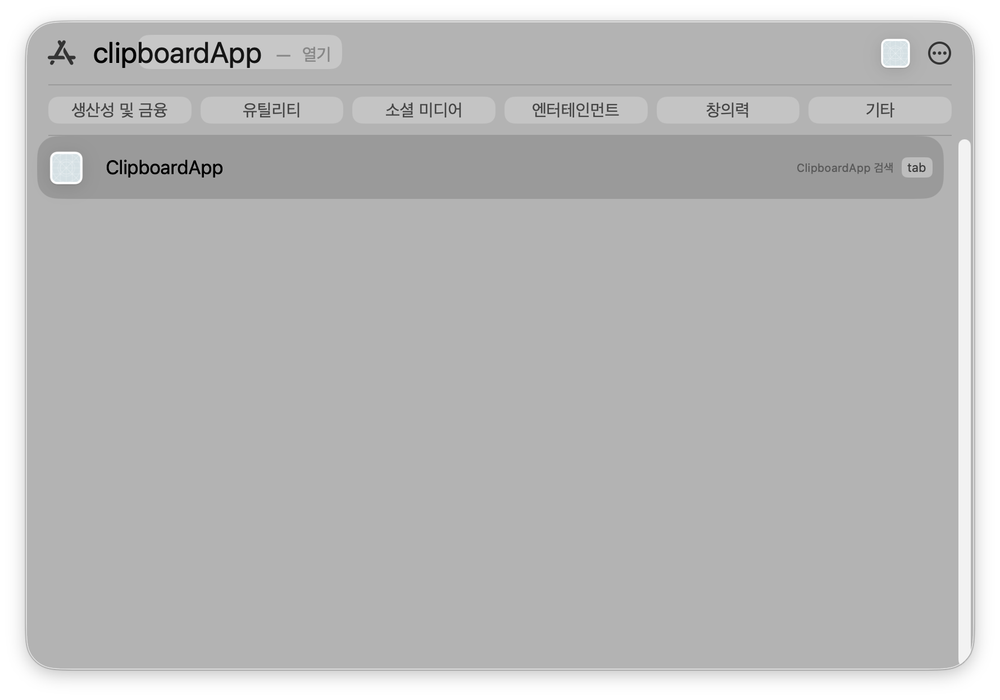
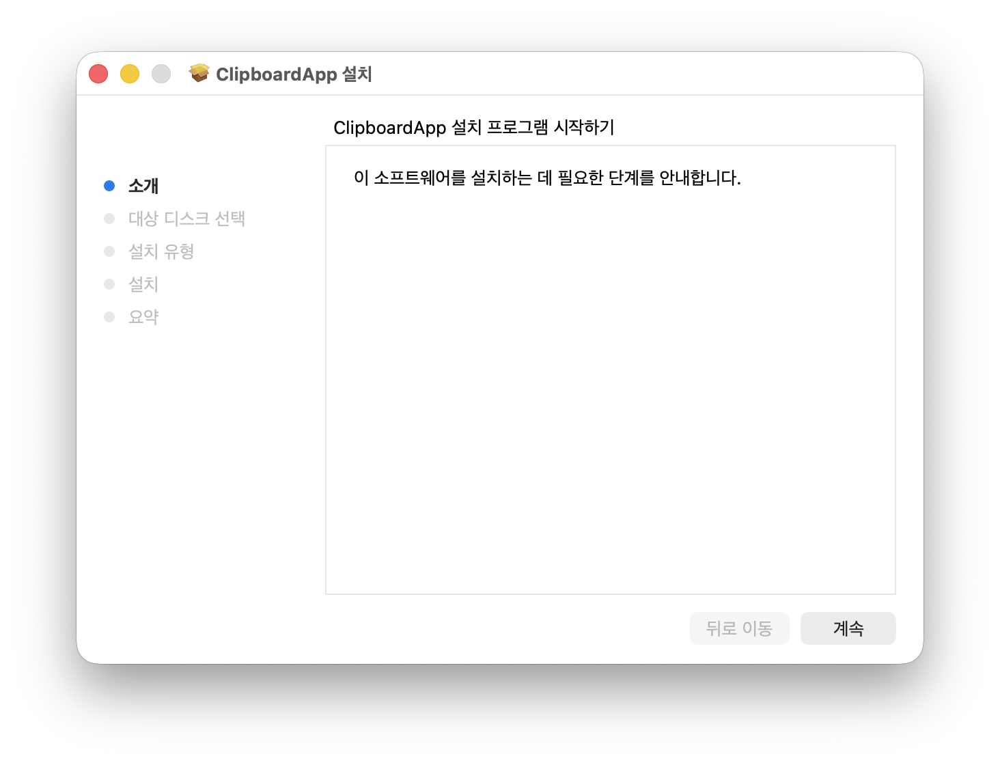
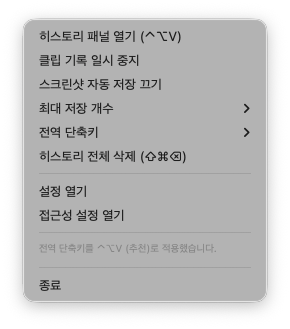
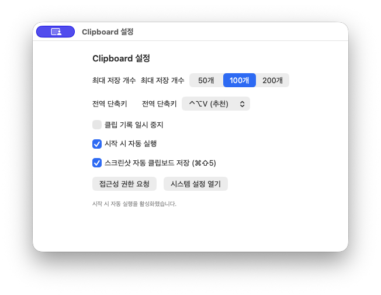

# ClipboardApp (macOS)

macOS에서 `Ctrl + Option + V`로 클립보드 히스토리를 열고, 키보드만으로 빠르게 붙여넣기할 수 있는 앱입니다.



## 한눈에 보기
- 히스토리 패널 열기: `⌃⌥V`
- 선택/이동: `↑/↓`, `⌘1..9`
- 붙여넣기: `Enter`
- 삭제: `⌘⌫` (전체 삭제 `⇧⌘⌫`)
- 스크린샷 자동 반영: `⌘⇧5`로 캡처한 이미지를 자동 저장

## 설치 및 실행 (비개발자용)

### 0) GitHub에서 배포파일 받기
가장 쉬운 방법은 GitHub `Releases`에서 받는 것입니다.

1. 저장소 상단의 `Releases` 탭 이동
2. 최신 릴리즈의 `Assets`에서 아래 파일 다운로드
   - `ClipboardApp-installer.pkg` (권장)
   - `ClipboardApp.app.zip` 또는 `ClipboardApp.app` (제공 시)

릴리즈가 아직 없으면 저장소의 `release/mac-clipboard-v1.0.0` 브랜치에서 `dist/` 폴더 파일을 직접 다운로드할 수 있습니다.

### 1) 설치 파일
- 더블클릭 설치 파일: `dist/ClipboardApp-installer.pkg`
- 설치 없이 바로 실행 파일: `dist/ClipboardApp.app`

### 2) 권장 설치 방법
1. `dist/ClipboardApp-installer.pkg` 더블클릭
2. 설치 완료 후 `/Applications/ClipboardApp.app` 더블클릭 실행



### 3) 최초 실행 시 경고가 뜨는 경우
무료 배포본(미노터라이즈)은 macOS 경고가 뜰 수 있습니다.

1. Finder에서 앱 우클릭 → `열기`
2. 시스템 설정 > 개인정보 보호 및 보안에서 실행 허용

## 사용 화면

### 히스토리 패널


### 설정 창


## 권한 안내
- 자동 붙여넣기를 사용하려면 `손쉬운 사용(Accessibility)` 권한이 필요합니다.
- 권한이 없으면 클립보드 복사까지만 수행되며, 사용자가 `⌘V`로 수동 붙여넣기할 수 있습니다.

---

## 개발자 가이드

### 로컬 실행
```bash
cd /Users/kkongwang/Documents/clipboard
swift run ClipboardApp
```

### 빌드 산출물 생성
```bash
./scripts/build_app_bundle.sh
./scripts/package_installer_pkg.sh
```

산출물:
- `dist/ClipboardApp.app`
- `dist/ClipboardApp-installer.pkg`

### 배포파일 업로드 위치
- `Releases`에 업로드할 원본 파일은 `dist/`에 생성됩니다.
- 무료 사용자 배포 기준으로도 `dist/` 파일을 GitHub에서 직접 다운로드 가능하게 유지합니다.

### (선택) 유료 계정용 서명/노터라이즈
```bash
./scripts/sign_and_notarize.sh
```

### CI 릴리스 템플릿
- `fastlane/Fastfile`
- `.github/workflows/release.yml`

## README 이미지 추가 방법
1. 이미지 파일을 `docs/images/`에 추가
2. README에 다음 형식으로 삽입

```md

```

3. 커밋/푸시하면 GitHub에서 바로 표시됩니다.
